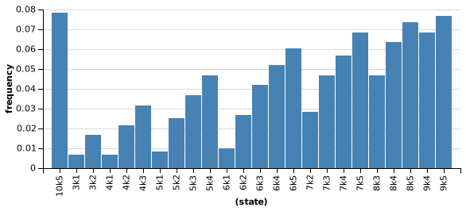
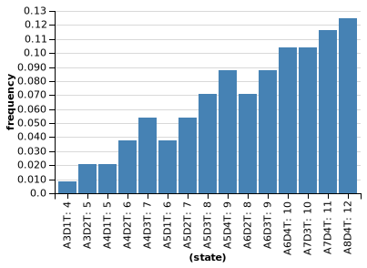
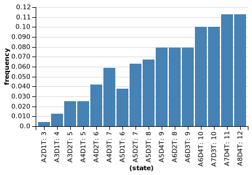
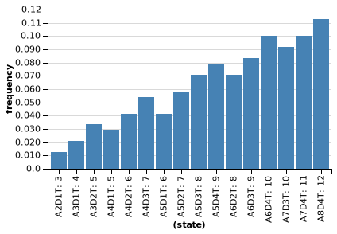
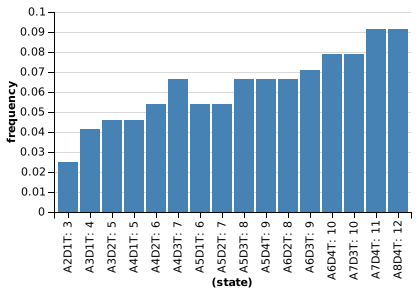
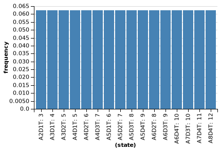

# Ficha 2

### 1. Escreva uma função que receba o número de dados e o número de faces de cada dado e imprima o histograma relativo a 10,000 lançamentos. Represente o histograma para os seguintes valores: 5d2; 2d5; 4d6; 2d100; 100d2;

~~~~
var make_dice = function(n){
  return function(){return categorical({vs:mapN(function(x){return x+1},n)})}
}

var make_dices = function(N,n){
  return function(){
    var dice = make_dice(n)
    return sum(repeat(N,dice))
  }
}
var n = 10000
console.log("5d2")
var dice = make_dices(5,2)
viz(repeat(n,dice))

console.log("2d5")
var dice = make_dices(2,5)
viz(repeat(n,dice))

console.log("4d6")
var dice = make_dices(4,6)
viz(repeat(n,dice))

console.log("2d100")
var dice = make_dices(2,100)
viz(repeat(n,dice))

console.log("100d2")
var dice = make_dices(100,2)
viz(repeat(n,dice))
~~~~

### 2. Crie uma nova função onde os dados repetidos são removidos;

~~~~
var make_dice = function(n){
  return function(){return categorical({vs:mapN(function(x){return x+1},n)})}
}

var get_differents = function(v,acc){
  if (!any(function(x){x == v},acc)) return acc.concat(v)
  else return acc
}

var make_dices_differents = function(N,n){
  return function(){
    var dice = make_dice(n)
    var aux = repeat(N,dice)
    return sum(reduce(get_differents,[],aux))
  }
}

var n = 10000
console.log("5d2")
var dice = make_dices_differents(5,2)
viz(repeat(n,dice))

console.log("2d5")
var dice = make_dices_differents(2,5)
viz(repeat(n,dice))

console.log("4d6")
var dice = make_dices_differents(4,6)
viz(repeat(n,dice))

console.log("2d100")
var dice = make_dices_differents(2,100)
viz(repeat(n,dice))

console.log("100d2")
var dice = make_dices_differents(100,2)
viz(repeat(n,dice))
~~~~

### 3.Crie uma função para o sistema Roll & Keep. Represente o histograma para 1k1; 3k1; 5k1; 7k2; 9k4

~~~~
var make_dice = function(n){
  return function(){return categorical({vs:mapN(function(x){return x+1},n)})}
}

var exploding_dice = function(x,acc){
  var add_value = function(v){
    if (v == 10) return v+add_value(make_dice(10)())
    else return v
  }
  return acc.concat(add_value(x))
}

var make_dices = function(N,n){
  return function(){
    var dice = make_dice(n)
    var results = repeat(N,dice)
    return results
  }
}

var RollKeep = function(R,K){
  var dices = make_dices(R,10)
  var r = sort(dices())
  var aux = sort(reduce(exploding_dice,[],r))
  var results = reduce(function(x,acc){
    if (acc.length < K) return acc.concat(x)
    else return acc
  },[],aux)
  return results
}

console.log('1k1: ',RollKeep(1,1))
console.log('3k1: ',RollKeep(3,1))
console.log('5k1: ',RollKeep(5,1))
console.log('7k2: ',RollKeep(7,2))
console.log('9k4: ',RollKeep(9,4))
~~~~

### 4. Crie uma função para o sistema WoD. Represente o histograma do nº de sucessos para vários nºs de dados e TN

~~~~
var make_dice = function(n){
  return function(){return categorical({vs:mapN(function(x){return x+1},n)})}
}

var make_dices = function(N,n){
  return function(){
    var dice = make_dice(n)
    var results = repeat(N,dice)
    return results
  }
}

var WoD = function(A,D,TN){
  var dices = make_dices(A+D,10)
  var res = dices()
  return reduce(function(x,acc){
    if (x >= TN) return acc+1
    else if (x == 1) return acc-1
    else return acc
  },0,res)
}

var make_hists = function(N,n){
  if (N != 0){
    var a = make_dice(n)()
    var d = make_dice(n)()
    var TN = make_dice(n)()
    console.log('WoD A: '+a+' D: '+d+' TN: '+TN)
    viz(repeat(1000,function(){return WoD(a,d,TN)}))
    make_hists(N-1,n)
  }
}

make_hists(4,10)
~~~~

### 5. Represente gráficamente o nº de sucessos para os vários TN usando um heatmap quando se lançam 10 dados;

~~~~
var make_dice = function(n){
  return function(){return categorical({vs:mapN(function(x){return x+1},n)})}
}

var make_dices = function(N,n){
  return function(){
    var dice = make_dice(n)
    var results = repeat(N,dice)
    return results
  }
}

var WoD = function(A,D,TN){
  var dices = make_dices(A+D,10)
  var res = dices()
  return reduce(function(x,acc){
    if (x >= TN) return acc+1
    else if (x == 1) return acc-1
    else return acc
  },0,res)
}

var n = 1000
viz.heatMap(repeat(n,function(){
  var TN = make_dice(10)()
  return [TN,WoD(5,5,TN)]
}))

viz.heatMap(Infer(function(){
  var TN = make_dice(10)()
  return [TN,WoD(5,5,TN)]
}))
~~~~

### 6. Represente um heatmap com o nº de dados vs o nº de sucessos para o TN de 9;

~~~~
var make_dice = function(n){
  return function(){return categorical({vs:mapN(function(x){return x+1},n)})}
}

var make_dices = function(N,n){
  return function(){
    var dice = make_dice(n)
    var results = repeat(N,dice)
    return results
  }
}

var WoD = function(A,D,TN){
  var dices = make_dices(A+D,10)
  var res = dices()
  return reduce(function(x,acc){
    if (x >= TN) return acc+1
    else if (x == 1) return acc-1
    else return acc
  },0,res)
}

var n = 1000
viz.heatMap(repeat(n,function(){
  var a = make_dice(10)()
  var d = make_dice(10)()
  return [a+d,WoD(a,d,9)]
}))

viz.heatMap(Infer(function(){
  var a = make_dice(10)()
  var d = make_dice(10)()
  return [a+d,WoD(a,d,9)]
}))
~~~~

### 7. Represente graficamente contested rolls de Roll & Keep; veja o impacto dos Traits e Skills;

~~~~
var make_dice = function(n){
  return function(){return categorical({vs:mapN(function(x){return x+1},n)})}
}

var exploding_dice = function(x,acc){
  var add_value = function(v){
    if (v == 10) return v+add_value(make_dice(10)())
    else return v
  }
  return acc.concat(add_value(x))
}

var make_dices = function(N,n){
  return function(){
    var dice = make_dice(n)
    var results = repeat(N,dice)
    return results
  }
}

var RollKeep = function(R,K){
  var dices = make_dices(R,10)
  var r = sort(dices())
  var aux = sort(reduce(exploding_dice,[],r))
  var results = reduce(function(x,acc){
    if (acc.length < K) return acc.concat(x)
    else return acc
  },[],aux)
  return sum(results)
}

var game = function(r1,k1,r2,k2){
  var p1 = RollKeep(r1,k1)
  var p2 = RollKeep(r2,k2)
  if (p1 > p2) return 0
  else if (p1 == p2) return 2
  else return 1
}

var N = 5
var step = 1
var t = reduce(function(x,acc){return acc.concat(mapN(function(){return x},N))},[],mapN(function(x){return x*step+1},N))
var s = reduce(function(x,acc){return acc.concat(mapN(function(x){return x*step+1},N))},[],mapN(function(x){return x},N))
var TS = zip(t,s)
var results = reduce(function(x,acc){
  var r1 = x[0]+x[1]
  var k1 = x[1]
  console.log(r1,'k',k1)
  return acc.concat(reduce(function(x,acc){
    var r2 = x[0]+x[1]
    var k2 = x[1]
    if (r2 == r1 && k2 == k1) return acc
    var res = sum(repeat(100,function(){return game(r1,k1,r2,k2)}))
    if (res < 50){
      return acc.concat(r1.toString()+'k'+k1.toString())
    }
    else if (res > 50){
      return acc.concat(r2.toString()+'k'+k2.toString())
    }
    else return acc
  },[],TS))
},[],TS)
viz(results)
~~~~

Resultados do *Battle Royale* entre varias combinações

### 8. Represente graficamente contested rolls de WoD; veja o impacto no nº de dados.

~~~~
var make_dice = function(n){
  return function(){return categorical({vs:mapN(function(x){return x+1},n)})}
}

var make_dices = function(N,n){
  return function(){
    var dice = make_dice(n)
    var results = repeat(N,dice)
    return results
  }
}

var WoD = function(A,D,TN){
  var dices = make_dices(A+D,10)
  var res = dices()
  return reduce(function(x,acc){
    if (x >= TN) return acc+1
    else if (x == 1) return acc-1
    else return acc
  },0,res)
}

var game = function(a1,d1,a2,d2,TN){
  var p1 = WoD(a1,d1,TN)
  var p2 = WoD(a2,d2,TN)
  if (p1 > p2) return 0
  else if (p1 == p2) return 2
  else return 1
}

var N = 5
var step = 1
var a = reduce(function(x,acc){return acc.concat(mapN(function(){return x},N))},[],mapN(function(x){return x*step+1},N))
var d = reduce(function(x,acc){return acc.concat(mapN(function(x){return x*step+1},N))},[],mapN(function(x){return x},N))
var AD = zip(a,d)
var TN = mapN(function(x){return x*2+1},10)
var plot_graph = function(tn){
  var results = reduce(function(x,acc){
    var r1 = x[0]+x[1]
    var k1 = x[1]
    return acc.concat(reduce(function(x,acc){
      var r2 = x[0]+x[1]
      var k2 = x[1]
      if (r2 == r1 && k2 == k1) return acc
      var res = sum(repeat(100,function(){return game(r1,k1,r2,k2,tn)}))
      if (res < 50){
        return acc.concat('A'+r1.toString()+'D'+k1.toString()+'T: '+(r1+k1).toString())
      }
      else if (res > 50){
        return acc.concat('A'+r2.toString()+'D'+k2.toString()+'T: '+(r2+k2).toString())
      }
      else return acc
    },[],AD))
  },[],AD)
  console.log('TN: ',tn)
  viz(results)
}

map(plot_graph,TN)
~~~~

Resultados do *Battle Royale* entre varias combinações para diferentes TN

TN = 1

TN = 3

TN = 5

TN = 7

TN = 9
